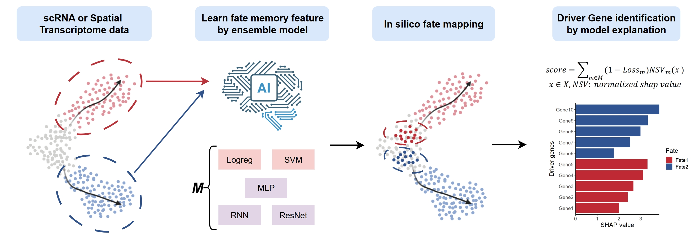

# Ageas: a transfer learning framework for in silico cell fate mapping from single-cell and spatial transcriptomics
### The manuscript for Ageas is currently in preparation, and the preprint and source code will be released upon reaching a significant milestone.

Understanding cell fate decisions is fundamental to developmental biology and disease research. However, experimental lineage tracing approaches typically require genetic manipulation and are difficult to apply in complex systems or human tissues. Computational methods based on optimal transport often depend on multi-timepoint data, which are frequently unavailable in single-cell and spatial transcriptomic studies.

Here, we present AGEAS, a transfer learning framework for in silico fate mapping single-cell or spatial transcriptomic data. AGEAS overcomes both experimental and computational limitations by transferring fate memory features from progeny to progenitor cells, enabling robust lineage reconstruction and lineage driver transcription factors identification without requiring temporal information or genetic barcoding. We benchmark AGEAS against single-cell lineage tracing and spatial transcriptomic datasets, where it achieves state-of-the-art performance. Applying AGEAS to a 3D human embryo model, we uncover fate biases of the epiblast along the anterior-posterior axis and identify SOX2 as a regional regulator of epiblast fate.

